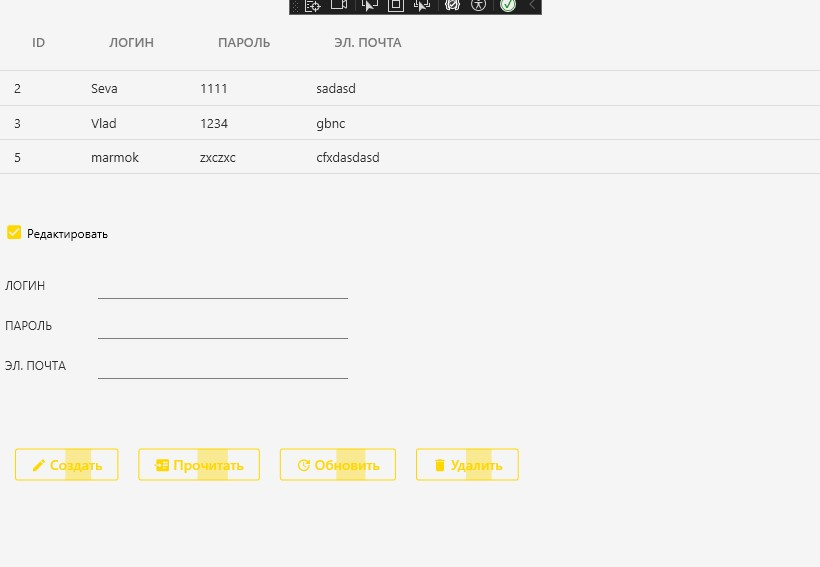

<h1>Задание 5. Использование EntityFrameworkCore и SQLite</h1>

  WPF-приложение для управления пользователями с функционалом:
  <ul>
    <li>Аутентификация пользователей</li>
    <li>Редактирование пользовательских данных</li>
  </ul>
  Реализовано с использованием:
  <ul>
    <li>Entity Framework Core (ORM)</li>
    <li>SQLite (встроенная база данных)</li>
  </ul>

  <strong>Требования к запуску:</strong>
  <ul>
    <li>Запустить исполняемый файл "Task5SQLite.exe"</li>
  </ul>

  
  

